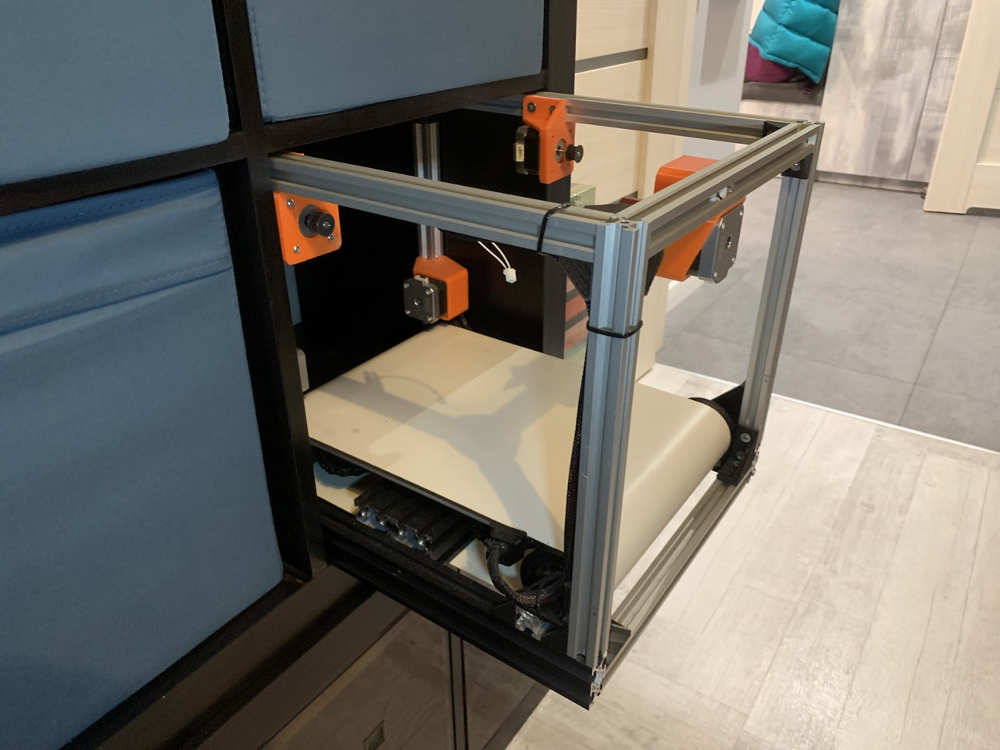

# printa-kube-3
E3 based Cube (Kube) printer that fits into Swedish furniture manufacturer's shelving system.

**Table of Contents**

- [Inspiration](#inspiration)
  - [Bonus inspiration](#bonus-inspiration) 
- [Goals](#goals)
  - [Fit into IKEA Kallax shelving system](#fit-into-ikea-kallax-shelving-system)
  - [Use as many parts from Ender-3 as possible](#use-as-many-parts-from-ender-3-as-possible)
  - [Change Y axis - bed into endless belt](#change-y-axis---bed-into-endless-belt)
  - [Change X and Z axis into Core-XZ](#change-x-and-z-axis-into-core-xz)
- [Design](design/)
  - [Belt](design/belt.md) 
- [Untested/Flawed decisions](#untestedflawed-decisions)
  - [Belt centering](#belt-centering)
- [Handoff](#handoff)

## Inspiration

My first ever printer was Ender-3 but what often annoyed me was that it was constantly collecting dust and took a lot of space on my desk.  

One day I noticed this project: <https://www.thingiverse.com/thing:4783875> and this inspired the `printa-kube-3`:
 * printa - because it's a printer
 * kube - because it's a cube
 * 3 - because it's based on Ender-3

But this initially didn't spark the idea in me to base this on Ender-3. I was initially put off because it required a lot of custom parts. And I wanted to reuse my already existing parts. Then I noticed this two projects:
 * <https://www.youtube.com/watch?v=qTVXgcrKZ4U>
    * <https://belt3dprinterkit.com/>
 * <https://www.youtube.com/watch?v=gruBm8ppwgY>
   * <https://powerbelt3d.com/>
 * <https://www.youtube.com/watch?v=hgTfSCgL0L0>

With those 4 inspirations I finally knew what I wanted to build.

### Bonus inspiration
Because this project is so easy (*sarcasm) I was inspired by <https://www.youtube.com/watch?v=Cv5pEcBI5Hw> to make this printer portable. But that work should start after I have working printer.

## Goals
 * Fit into IKEA Kallax shelving system
 * Use as many parts from Ender-3 as possible
 * Change Y axis - bed into endless belt
 * (optional?) Change X and Z axis into Core-XZ

### Fit into IKEA Kallax shelving system
I have a lot of IKEA Kallax shelves at home and I wanted to fit the printer into one of those shelves. I decided to use Kallax shelf as a base for the printer. This means that printer needs to have a maximum outside diameters of 33x33x40cm.

### Use as many parts from Ender-3 as possible
Turns out that many of the parts from Ender-3 can be reused. I will try to reuse as many parts as possible. This will allow me to keep the cost down and also allow me to use the parts I already have. This includes 2020 profiles but also electronics, motors, belts, pulleys, etc.

### Change Y axis - bed into endless belt
Slingshot bed of Ender-3 wasn't a good fit to fit into Kallax shelf. I decided to change it into endless belt. But because gantry is still perpendicular to the belt, I will need to use Core-XZ kinematics. It doesn't offer endless printing of infinitely long objects but it allows to print small objects and push them out of the printer without operator intervention.

### Change X and Z axis into Core-XZ
(I'm not sure about this one)
In <https://www.youtube.com/watch?v=gruBm8ppwgY> they use Core-XZ kinematics, and I think `printa-kube-3` should also have Core-XZ. It would allow for better use of space compared to standard Ender-3 gantry kinematics but also fixes a problem of sagging X axis.

## Untested/Flawed decisions
There are some decisions I needed to make really early in design process that I couldn't test initially. They are documented here.

### Belt centering
Centering the belt is common issue on 3D printers but also on many other belt driven machines. To mitigate this issue, there are 2 mitigations:
1. Driven pulley has very flexible mounting to allow for alignment and tensioning. Tensioning is also done by springs and motors.
2. Idler pulley has increasing diameter to allow for belt centering. I initially decided that outside diameter should be bigger then inside of belt. But this video suggests otherwise: <https://www.youtube.com/watch?v=-iJWfGVrU74>. I will need to revisit this decision.

## Handoff
On beginning of December 2023 I decided to hand off the project to someone else. I will still be available for questions and I will still be consulting on the project but I will not be the main person working on it. - ipepe

Photos with current state of work are available at: [report-on-stages-of-work/2023-12-handoff/](report-on-stages-of-work/2023-12-handoff/)