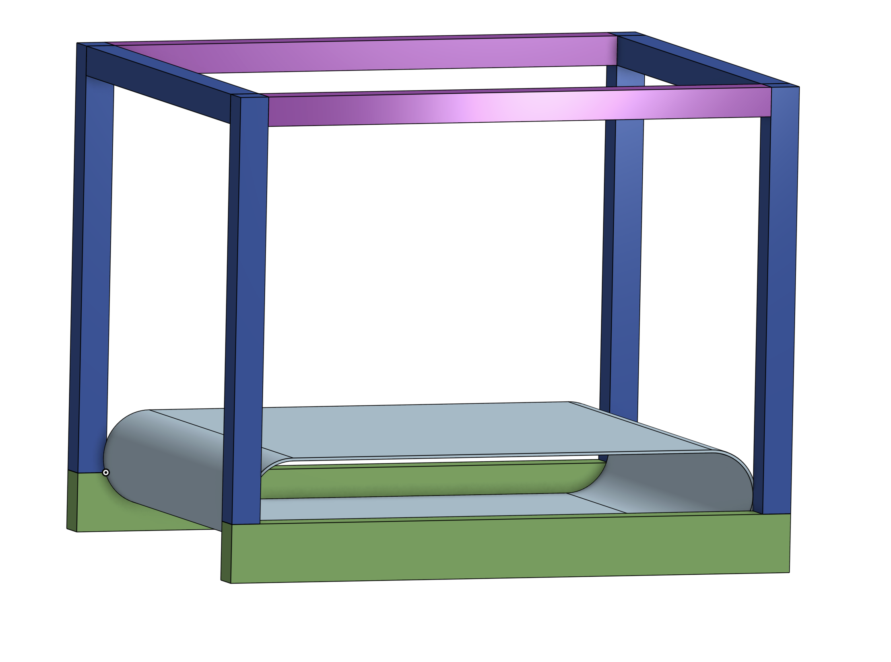

# Belt
Based on inspirations, I decided that this printer should have a belt. Initially I didn't want to reinvent the wheel  and I wanted to use existing belt designs either from Creality CR-30 or something similiar. But the first problem was that it was too big and second that it was too expensive. I decided to source my belt from other sources. I bought 2 belts:
 * `Habasit Conveyor Belt F-2EQWT 790 MM X 250 MM ENDLESS WHITE` from ebay. The link is constantly changing so google it.
 * `780x250x2mm Industrial Transmission Line Belt Conveyor PVC Green Flat Belt` from aliexpress. It was custom offer from `Shop5442010 Store` seller.

Additionally I bought `Promotion! 1x 250mm*33M*0.08mm Green PET Film Adhesive PCB Masking Tape, High Temperature Resist` from `Adhesive & Heat Transfer -- RP. Reliable` on Aliexpress to cover the white belt with PET tape if it turns out to be too fragile and not resistant to heat and overall 3D Printing process.

## Belt sizing

I messaged the seller of Green PVC belt with question about minimum diameter roller size. He responded that it should be 60mm. I quickly drafted printer frame with roller size 60mm and spacing between rollers 300mm. With the belt that is 2mm thick it resulted in 800mm. So perfectly for my use case.

